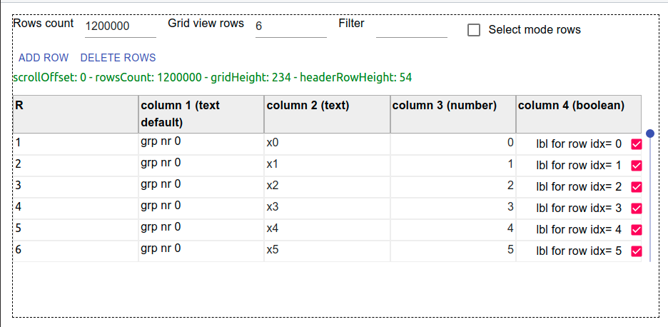

# react-wseditor

> react worksheet like editor

[](https://www.npmjs.com/package/react-wseditor) [](https://standardjs.com)

- [Quickstart](#quickstart)
- [Examples](#examples)
- [Features](#features)
- [How to contribute (quickstart)](#how-to-contribute-quickstart)
- [development keynotes](#development-keynotes)

---

## Quickstart

```bash
yarn create react-app my-app --typescript
cd my-app
yarn add react-wseditor
code .
```

from vscode terminal issue a `yarn start` this will open browser for application debug

follow an example of react functional component ( requires `yarn add chance @types/chance` in order to work )

```ts
import React, { useState, useEffect } from "react";
import Chance from 'chance';

import { WSEditor, WSEditorColumn } from 'react-wseditor';

interface MyData {
    name: string;
    value1: number;
    value2: number;
    value3: number;
}

export default function MyComponent() {
    const [rows, setRows] = useState<MyData[]>([]);
    const [cols, setCols] = useState<WSEditorColumn<MyData>[]>([]);

    const SIZE_TEST = 10000;

    useEffect(() => {
        setCols([
            { header: "name", field: "name", defaultEditor: "text" },
            { header: 'value1', field: 'value1', defaultEditor: "number" },
            { header: 'value2', field: 'value2', defaultEditor: "number" },
            { header: 'value3', field: 'value3', defaultEditor: "number" },
        ]);

        const r: MyData[] = [];
        const chance = new Chance();
        for (let i = 0; i < SIZE_TEST; ++i) {
            r.push({
                name: chance.word(),
                value1: chance.minute(),
                value2: chance.floating({ min: 0, max: 1e6, fixed: 4 }),
                value3: chance.floating({ min: 0, max: 1e9, fixed: 2 })
            });
        }
        setRows(r);
    }, []);

    return <WSEditor
        debug={true}
        viewRowCount={6}
        rows={rows} setRows={setRows}
        cols={cols} setCols={setCols} />
}
```

## Examples

- basic example ( [test03](https://codesandbox.io/s/github/devel0/react-wseditor-demo/tree/e22dafde541a9bc1ae876d93a6022d25c33bca23/test03) - [source](https://github.com/devel0/react-wseditor-demo/tree/master/test03) )

- customization example ( [test02](https://codesandbox.io/s/github/devel0/react-wseditor-demo/tree/cdfeacdbfe4d94e9e24babd055efc3a5e540c598/test02) - [source](https://github.com/devel0/react-wseditor-demo/tree/master/test02) )



## Features

- virtualized grid ( allow to manage millions of rows )
- [text][1]/[numeric][2]/[boolean][3] or [inline custom][15] cell controls
- easy to extend from base [cell editor][4]
- cell container and control [styles][14] can be overriden
- programmatic control of editor ( see example [add][5], [del][6] rows and scroll )
- [cell/row][7] selection mode ( [multiple selection][8] through mouse and ctrl key )
- worksheet like keyboard navigation ( cursor, home/end, ctrl+home/end, direct editing or F2, canc to delete cell content )
- sortable columns ( hold shift for multilevel sort ) with optional [custom sort][9]
- [column width][10] adjustable ( % or fixed )
- [initial sort][16]
- scroll horizontal if set editor width in an [overflow div][11]
- scrollbar [slider][12] can be hidden
- [readonly][13] mode
- [more ui style options][17] and their [default values][18]

[1]: https://github.com/devel0/react-wseditor/blob/5c48343ac1f82eb15ad5e61b9e59f7a4735164b4/src/WSEditor.tsx#L531
[2]: https://github.com/devel0/react-wseditor/blob/5c48343ac1f82eb15ad5e61b9e59f7a4735164b4/src/WSEditor.tsx#L602
[3]: https://github.com/devel0/react-wseditor/blob/5c48343ac1f82eb15ad5e61b9e59f7a4735164b4/src/WSEditor.tsx#L424
[4]: https://github.com/devel0/react-wseditor/blob/5c48343ac1f82eb15ad5e61b9e59f7a4735164b4/src/WSEditor.tsx#L327
[5]: https://github.com/devel0/react-wseditor-demo/blob/444c9d8399e220771175a6a2f679a6bd22253657/test02-dev/src/App.tsx#L249
[6]: https://github.com/devel0/react-wseditor-demo/blob/444c9d8399e220771175a6a2f679a6bd22253657/test02-dev/src/App.tsx#L257
[7]: https://github.com/devel0/react-wseditor-demo/blob/444c9d8399e220771175a6a2f679a6bd22253657/test02-dev/src/App.tsx#L269
[8]: https://github.com/devel0/react-wseditor-demo/blob/444c9d8399e220771175a6a2f679a6bd22253657/test02-dev/src/App.tsx#L270
[9]: https://github.com/devel0/react-wseditor-demo/blob/444c9d8399e220771175a6a2f679a6bd22253657/test02-dev/src/App.tsx#L62
[10]: https://github.com/devel0/react-wseditor-demo/blob/444c9d8399e220771175a6a2f679a6bd22253657/test02-dev/src/App.tsx#L61
[11]: https://github.com/devel0/react-wseditor-demo/blob/444c9d8399e220771175a6a2f679a6bd22253657/test02-dev/src/App.tsx#L272
[12]: https://github.com/devel0/react-wseditor/blob/5c48343ac1f82eb15ad5e61b9e59f7a4735164b4/src/WSEditor.tsx#L877
[13]: https://github.com/devel0/react-wseditor/blob/5c48343ac1f82eb15ad5e61b9e59f7a4735164b4/src/WSEditor.tsx#L876
[14]: https://github.com/devel0/react-wseditor-demo/blob/e53456bb58929d88ec9342bbcfff1805c328df7d/test02-dev/src/App.tsx#L279-L280
[15]: https://github.com/devel0/react-wseditor-demo/blob/ca906f7c7f659b1ce91795d22cea5f6f651c540a/test02/src/App.tsx#L61-L65
[16]: https://github.com/devel0/react-wseditor-demo/blob/e53456bb58929d88ec9342bbcfff1805c328df7d/test02-dev/src/App.tsx#L72-L73
[17]: https://github.com/devel0/react-wseditor/blob/5c48343ac1f82eb15ad5e61b9e59f7a4735164b4/src/WSEditor.tsx#L871
[18]: https://github.com/devel0/react-wseditor/blob/5c48343ac1f82eb15ad5e61b9e59f7a4735164b4/src/WSEditor.tsx#L766

## How to contribute (quickstart)

to establish development environment to contribute with PR see [here](https://github.com/devel0/react-wseditor-demo/blob/master/test01-dev/README.md#how-to-contribute-quickstart)

## development keynotes

to allow grid manage tons of rows was required by design to react only for view cells ( virtualized grid ) and manage mapping between rows data and cell views by pointing and converting view cell row index to data cell row index by a scroll offset information stored in editor state.

- editor
    - [props][100]
    - non templated [optional props][101]
    - [state][102] with info about scroll offset, focused view cell, selection, grid/header height
    - all displayed view cells are referenced through
        - a [map][103] for their [key][104] to cell [div element][108]
        - a [map][107] for their [key][104] to cell [editor element][109]
    - [view cell coord][105] can be converted to [data cell coord][106]
    - grid is created following this flow:
        - [main grid][110]
            - first row [headers][112]
            - [view rows][113] render that render in turn each [row editor][114]
        - [side slider][111]
- [row editor][115] is the point where [keyboard][116] [(2)][117], [mouse][118] [(2)][119] interactions happens
    - if key handled by engine then [current cell][124] could change and [editor set current cell][125] handler can handle to extend or replace current selection while row editor [represent cell/row selection][126] by changing style
    - finally row render [each cell][120] choosing between [default or custom][121] cell editor
- columns
    - toggle [sort][122] uses [editor sort handler][123]
- other keyboard/mouse managements points
    - [slider][127]
    - [horizontal scroll][128] and [workaround][129]

[100]: https://github.com/devel0/react-wseditor/blob/5c48343ac1f82eb15ad5e61b9e59f7a4735164b4/src/WSEditor.tsx#L854
[101]: https://github.com/devel0/react-wseditor/blob/5c48343ac1f82eb15ad5e61b9e59f7a4735164b4/src/WSEditor.tsx#L871
[102]: https://github.com/devel0/react-wseditor/blob/5c48343ac1f82eb15ad5e61b9e59f7a4735164b4/src/WSEditor.tsx#L931
[103]: https://github.com/devel0/react-wseditor/blob/5c48343ac1f82eb15ad5e61b9e59f7a4735164b4/src/WSEditor.tsx#L944
[104]: https://github.com/devel0/react-wseditor/blob/5c48343ac1f82eb15ad5e61b9e59f7a4735164b4/src/WSEditor.tsx#L1664
[105]: https://github.com/devel0/react-wseditor/blob/5c48343ac1f82eb15ad5e61b9e59f7a4735164b4/src/WSEditor.tsx#L1662
[106]: https://github.com/devel0/react-wseditor/blob/5c48343ac1f82eb15ad5e61b9e59f7a4735164b4/src/WSEditor.tsx#L306
[107]: https://github.com/devel0/react-wseditor/blob/5c48343ac1f82eb15ad5e61b9e59f7a4735164b4/src/WSEditor.tsx#L956
[108]: https://github.com/devel0/react-wseditor/blob/5c48343ac1f82eb15ad5e61b9e59f7a4735164b4/src/WSEditor.tsx#L275
[109]: https://github.com/devel0/react-wseditor/blob/5c48343ac1f82eb15ad5e61b9e59f7a4735164b4/src/WSEditor.tsx#L343
[110]: https://github.com/devel0/react-wseditor/blob/5c48343ac1f82eb15ad5e61b9e59f7a4735164b4/src/WSEditor.tsx#L1358-L1382
[111]: https://github.com/devel0/react-wseditor/blob/5c48343ac1f82eb15ad5e61b9e59f7a4735164b4/src/WSEditor.tsx#L1383-L1431
[112]: https://github.com/devel0/react-wseditor/blob/5c48343ac1f82eb15ad5e61b9e59f7a4735164b4/src/WSEditor.tsx#L1371-L1376
[113]: https://github.com/devel0/react-wseditor/blob/5c48343ac1f82eb15ad5e61b9e59f7a4735164b4/src/WSEditor.tsx#L1257
[114]: https://github.com/devel0/react-wseditor/blob/5c48343ac1f82eb15ad5e61b9e59f7a4735164b4/src/WSEditor.tsx#L1275
[115]: https://github.com/devel0/react-wseditor/blob/5c48343ac1f82eb15ad5e61b9e59f7a4735164b4/src/WSEditor.tsx#L26
[116]: https://github.com/devel0/react-wseditor/blob/5c48343ac1f82eb15ad5e61b9e59f7a4735164b4/src/WSEditor.tsx#L73
[117]: https://github.com/devel0/react-wseditor/blob/5c48343ac1f82eb15ad5e61b9e59f7a4735164b4/src/WSEditor.tsx#L192
[118]: https://github.com/devel0/react-wseditor/blob/5c48343ac1f82eb15ad5e61b9e59f7a4735164b4/src/WSEditor.tsx#L32
[119]: https://github.com/devel0/react-wseditor/blob/5c48343ac1f82eb15ad5e61b9e59f7a4735164b4/src/WSEditor.tsx#L49
[120]: https://github.com/devel0/react-wseditor/blob/5c48343ac1f82eb15ad5e61b9e59f7a4735164b4/src/WSEditor.tsx#L205
[121]: https://github.com/devel0/react-wseditor/blob/5c48343ac1f82eb15ad5e61b9e59f7a4735164b4/src/WSEditor.tsx#L240-L256
[122]: https://github.com/devel0/react-wseditor/blob/5c48343ac1f82eb15ad5e61b9e59f7a4735164b4/src/WSEditor.tsx#L735
[123]: https://github.com/devel0/react-wseditor/blob/5c48343ac1f82eb15ad5e61b9e59f7a4735164b4/src/WSEditor.tsx#L1133
[124]: https://github.com/devel0/react-wseditor/blob/5c48343ac1f82eb15ad5e61b9e59f7a4735164b4/src/WSEditor.tsx#L171
[125]: https://github.com/devel0/react-wseditor/blob/5c48343ac1f82eb15ad5e61b9e59f7a4735164b4/src/WSEditor.tsx#L1069
[126]: https://github.com/devel0/react-wseditor/blob/5c48343ac1f82eb15ad5e61b9e59f7a4735164b4/src/WSEditor.tsx#L219-L220
[127]: https://github.com/devel0/react-wseditor/blob/5c48343ac1f82eb15ad5e61b9e59f7a4735164b4/src/WSEditor.tsx#L1398-L1421
[128]: https://github.com/devel0/react-wseditor/blob/5c48343ac1f82eb15ad5e61b9e59f7a4735164b4/src/WSEditor.tsx#L58
[129]: https://github.com/devel0/react-wseditor/blob/5c48343ac1f82eb15ad5e61b9e59f7a4735164b4/src/WSEditor.tsx#L182

## how this project was built

```sh
npm create react-library react-wseditor --typescript
```
