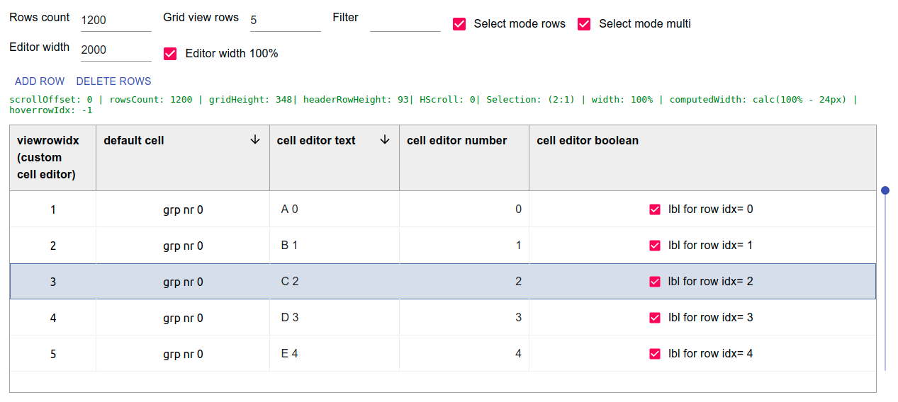

# react-wseditor

> react worksheet like editor

[](https://www.npmjs.com/package/react-wseditor) [](https://standardjs.com)

## Install

```bash
npm install --save react-wseditor
```

## Example

- live [DEMO](https://codesandbox.io/s/github/devel0/react-wseditor-demo/tree/62b3c059ef2b76a1d040a312cce1813b253f9f93/test01)

- example [SOURCE](https://github.com/devel0/react-wseditor-demo/tree/master/test01)



## Features

- virtualized grid ( allow to manage millions of rows )
- [text](https://github.com/devel0/react-wseditor/blob/master/src/WSEditorCellEditorText.tsx)/[numeric](https://github.com/devel0/react-wseditor/blob/master/src/WSEditorCellEditorNumber.tsx)/[boolean](https://github.com/devel0/react-wseditor/blob/master/src/WSEditorCellEditorBoolean.tsx) cell controls
- easy to extend from base [cell editor](https://github.com/devel0/react-wseditor/blob/master/src/WSEditorCellEditor.tsx)
- programmatic control of editor ( see example add,del rows and scroll )
- cell/row selection mode ( multiple selection through mouse and ctrl key )
- worksheet like keyboard navigation ( cursor, home/end, ctrl+home/end, direct editing or F2, canc to delete cell content )
- sortable columns ( hold shift for multilevel sort )
- scrollbar
- [options](https://github.com/devel0/react-wseditor/blob/master/src/WSEditorDefaultProps.tsx)

## How to contribute (quickstart)

to establish development environment to contribute with PR see [here](https://github.com/devel0/react-wseditor-demo/blob/master/test01-dev/README.md#how-to-contribute-quickstart)

## how this project was built

```sh
npm create react-library react-wseditor --typescript
```
